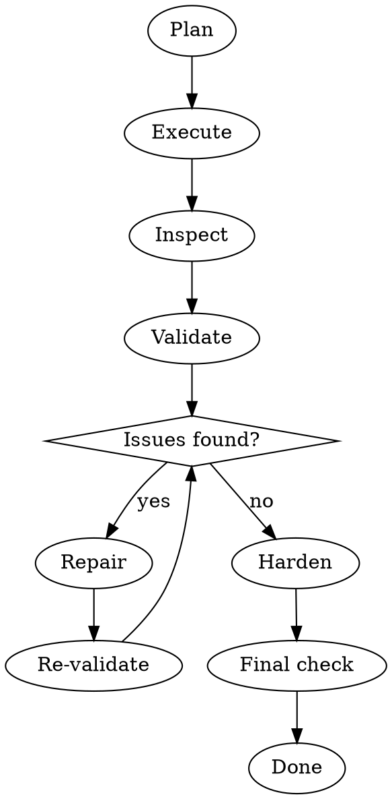

# Self-Healing Execution

## Overview

Continuously review, fix, and improve work until it is complete, stable, and usable. Do not stop at first attempt. Ensure everything works end to end before declaring done.

## Self-Healing Loop

## What Self-Healing Fixes Automatically

| Category | Examples |
|----------|---------|
| Logic | Broken logic, edge case failures, wrong sequencing |
| Integration | Poor integration, mismatched components, path issues |
| Structure | Fragile outputs, poor naming, inconsistencies |
| Dependencies | Missing dependencies, broken references, env assumptions |
| Completeness | Incomplete steps, missing setup, partial results |

## Applies To

- Code and scripts
- Automations and workflows
- Skills and configurations
- Documents requiring accuracy
- System setups and integrations

## Validation Checklist

After every execution pass, verify:

**Functional**
- [ ] Request fully completed
- [ ] Output works end to end
- [ ] Components align correctly
- [ ] References and dependencies correct
- [ ] Nothing obvious missing
- [ ] Usable without follow-up fixes

**Technical**
- [ ] No broken references
- [ ] No missing dependencies
- [ ] No naming inconsistencies
- [ ] No syntax issues
- [ ] No logic flaws
- [ ] No integration mismatches
- [ ] No incomplete setup
- [ ] No regressions

**Skill-specific (when validating skills)**
- [ ] No redundancy or overlap with existing skills
- [ ] Clear triggers
- [ ] No weak structure
- [ ] Complete rules

## Required Passes

1. **Execution pass** — build it
2. **Healing pass** — fix detected issues
3. **Validation pass** — verify end to end
4. Add passes until clean

## Quality Hardening (Before Final)

1. Improve clarity
2. Ensure consistency
3. Strengthen reliability
4. Improve usability
5. Reduce fragility

## Blocker Rule

Only ask the user when:
1. Credentials or login required
2. Critical ambiguity that cannot be inferred
3. External system blocks progress

Be concise and specific. One question, not a list.

## Failure Prevention

| Avoid | Instead |
|-------|---------|
| "I think this works" | Verify it works |
| "Try this" | Confirm it works before delivering |
| Declaring success early | Complete all validation passes |
| Leaving partial fixes | Iterate until resolved |
| Returning fragile output | Harden before finishing |

## Success Condition

Work is complete, stable, and does not require user correction.
