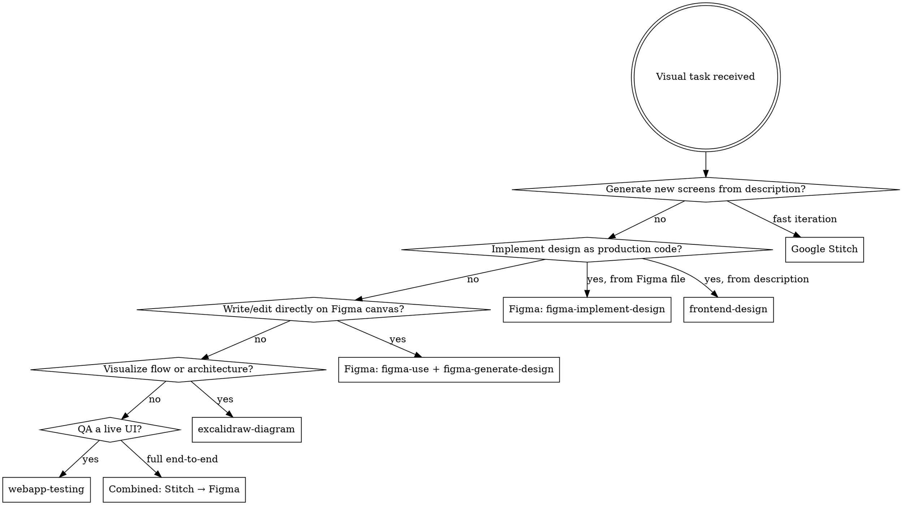

# UI Visual Creation Stack

## Overview

Full visual creation workflow for Claude Code using Google Stitch MCP and Figma MCP. Automatically routes tasks to the best tool, coordinates sub-agents, and produces visually coherent, implementation-aware outputs.

**Active tools:**
- **Google Stitch MCP** — generate screens from text, manage design systems, create variants (`mcp__stitch__*`)
- **Figma MCP** — write to canvas, implement designs as code, extract design context (`figma-use`, `figma-generate-design`, `figma-implement-design`, etc.)
- **frontend-design** — production-grade frontend code with strong aesthetic direction
- **excalidraw-diagram** — architecture and flow diagrams
- **webapp-testing** — visual QA and screenshot capture of live UIs

See [tool-reference.md](tool-reference.md) for complete command reference.
See [workflow-patterns.md](workflow-patterns.md) for step-by-step patterns.

---

## Routing Decision

**Default rules:**
- Fast screen generation or visual exploration → **Stitch**
- Need editable Figma layers or design system → **Figma**
- Producing frontend code → **frontend-design** or **figma-implement-design**
- Multi-step end-to-end → Stitch for generation, Figma for refinement

---

## Sub-Agent Roles

When task complexity justifies parallel agents, use these scoped roles:

| Agent | Scope | Does NOT do |
|-------|-------|-------------|
| **Visual Research Agent** | Research visual references, competitors, patterns, design trends | Generate output |
| **UI Structure Agent** | Layout hierarchy, component breakdown, information architecture | Visual styling |
| **Style Direction Agent** | Color, type, spacing, mood, aesthetic direction | Structure or code |
| **UX Flow Agent** | User flows, screen transitions, interaction logic | Visual production |
| **Accessibility Agent** | Contrast, ARIA roles, focus order, keyboard nav | Design generation |
| **Design System Agent** | Tokens, components, variables, design system rules | One-off production |
| **Handoff Agent** | Code generation from design, documentation, specs | New design work |

Keep agents scoped. Merge outputs into one coherent final result.

---

## Required Defaults

Every visual output must consider:

| Default | Rule |
|---------|------|
| Visual clarity | Structure before decoration |
| Implementation realism | Outputs should be buildable |
| Accessibility | WCAG AA contrast, readable type, focus-visible |
| Responsiveness | Mobile + desktop unless explicitly scoped to one |
| Modern conventions | Current product design patterns, not dated styles |
| Reusable systems | Prefer component-based thinking over one-off visuals |
| Polish | Clean, usable outputs — not gimmicky or over-engineered |
| Hierarchy | Clear information hierarchy in every layout |

---

## Activation Patterns

This skill activates for (examples — not exhaustive):

- "Design a dashboard for..."
- "Create screens for..."
- "Wireframe the onboarding flow"
- "Make a landing page for..."
- "Generate UI for the settings screen"
- "Redesign this component"
- "Create a design system for..."
- "Build a high-fidelity mockup"
- "What should this look like on mobile?"
- "Iterate on this design"
- "Generate 3 style directions for..."
- "Push this to Figma"
- "Create variants of this screen"
- "Review the visual quality of this UI"
- "Build a component library"

---

## Quality Gates

Before delivering any visual output:

1. Does the layout have clear visual hierarchy?
2. Are text sizes and spacing consistent?
3. Does the color system have sufficient contrast (WCAG AA)?
4. Is the design responsive or scoped correctly?
5. Are component names and structures reusable?
6. Does it match the stated context (product type, user, platform)?
7. Is the output implementation-ready or clearly documented for handoff?

---

## Failure Prevention

| Avoid | Instead |
|-------|---------|
| Generic "AI slop" aesthetics | Commit to a clear, intentional visual direction |
| Designing without structure | Start with layout and hierarchy |
| Ignoring device context | Always consider mobile vs desktop vs tablet |
| Skipping accessibility | Check contrast and focus order by default |
| Building one-offs | Design components and systems |
| Over-asking the user | Infer style direction from context, product type, and brand signals |
| Stopping after generation | Validate, iterate, and deliver complete outputs |
